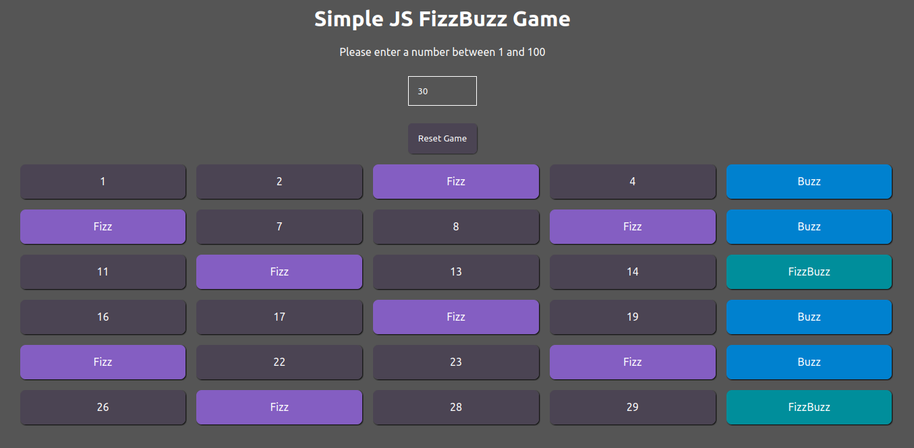

# js_fizzbuzz

## What is this?
A simple FizzBuzz game with a number input and a 
 tag showing all numbers from 1 to the inputed number.

Instead of a number it will print Fizz if the number is dividable by 3, Buzz if it is dividable by 5 and FizzBuzz if it is dividable by 3 and 5.

## Example
